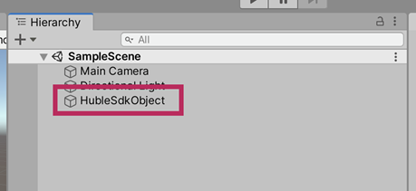
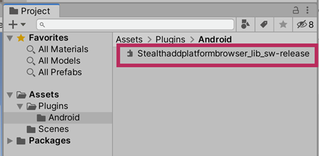
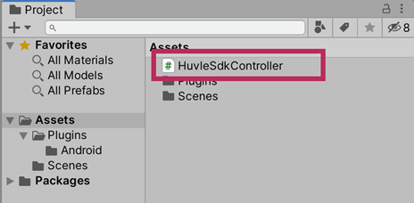
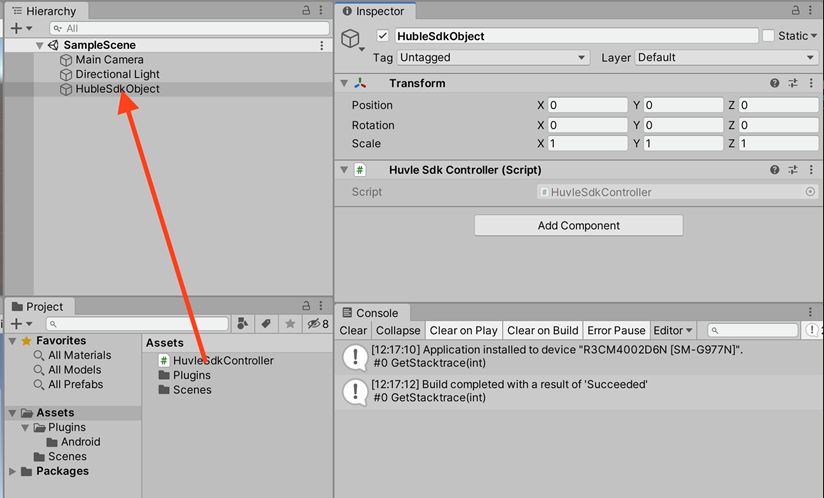
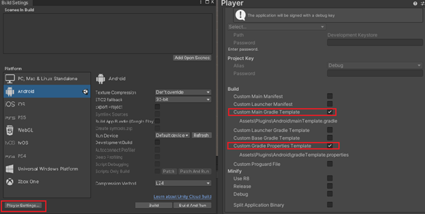

# HuvleView_SDK Unity3D install Guide

## 공통 기본 요건
- Unity 2020.3.25f1 이상 사용
- Google Play Service 20.5.0 이상
- Android Target API 35

##  허블뷰 설치 가이드
## Usage
### 1. HuvleSDK aar 다운로드
- .aar 파일은 사이트 내 제휴 문의를 이용해 주시기 바랍니다.

### 2. Hierachy 에 HuvleSDKObject 생성

1. Hierarchy 패널의 [+] 클릭
2. [Create Empty] 클릭
3. 생성된 Object 이름을 HuvleSdkObject로 변경(이름은 아무것이나 상관없음) 



### 3. Project 에 HuvleSDK 등록

1. Project 패널의 Assets 항목 아래에 Plugins/Android 없을 경우 폴더 생성(이름 정확히, 대소문자 구분)
2. 위에서 다운로드한 파일을 Assets/Plugins/Android 폴더에 드래그 & 드롭 하여 등록 (위에서 다운로드 받은HuvleSDK.aar)



### 4. Project 에 Huvle Script 생성

1. Project 패널의 [+] 클릭
2. [C# Script] 클릭
3. 생성된 Script 이름을 HuvleSdkController로 변경(이름은 아무것이나 상관없음)




### 5. Huvle Script 작성
- HuvleSdkContorller.cs
```
using System.Collections;
using System.Collections.Generic;
using UnityEngine;
using System;

public class HuvleSdkController : MonoBehaviour
{
void OnApplicationFocus(bool hasFocus) {
        if (hasFocus) {
            CallHuvleOnResume();
        }
    }
    private void CallHuvleOnResume() { 
        try {
            AndroidJavaClass unity_player = new AndroidJavaClass("com.unity3d.player.UnityPlayer"); 
            AndroidJavaObject activity = unity_player.GetStatic<AndroidJavaObject>("currentActivity"); 
            AndroidJavaClass share_plugin = new AndroidJavaClass("com.byappsoft.sap.UnityInterface"); 
            activity.Call("runOnUiThread", new AndroidJavaRunnable(() => {
                share_plugin.CallStatic("onResume", activity);
            })); 
        } catch (Exception ex) {
            Debug.Log("CallHuvleOnResume error:" + ex.Message); 
        }
    }
}
```

### 6. Huvle Script 와 Huvle Object 연결

1. Huvle Script 를 드래그 하여 Huvle Object 에 드롭



### 7. Unity Gradle Template 생성
1. [파일]->[Build Settings]->[Player Settings…] 메뉴 클릭
2. [Player] 항목에서 [Publishing Settings] 항목 펼침
3. [Build] 카테고리의 [Custom Main Gradle Template] , [Custom Gradle Properties Template] 항목 체크 
4. [Other settings] Minimum API Level 23, Target API Level android15(API Level 35) 선택



### 8. Custom Main Gradle Template 수정
1. Unity Gradle Template 생성을 하면 Project 패널의 Assets/Plugins/Android 폴더속에 mainTemplate 파일이 생성됨
2. mainTemplate 파일을 편집기로 열어 dependencies에 다음과 같이 추가함(appcompat, support-v4, play-services-ads)

```
.
.
dependencies {
    implementation fileTree(dir: 'libs', include: ['*.jar'])

    implementation 'com.android.support:appcompat-v7:28.0.0'
    implementation 'com.android.support:support-v4:28.0.0'
    implementation 'com.google.android.gms:play-services-ads-identifier:18.0.1'

**DEPS**}
.
.
```

### 9. Custom Gradel Properties Template 수정 (androX 적용)
1. Project 패널의 Assets/Plugins/Android 폴더속에 gradleTemplate 파일이 생성됨
2. GradleTemplate 파일을 편집기로 열어 다음과 같이 추가함
(android.enableJetifier=true , android.useAndroidX=true  )

```
org.gradle.jvmargs=-Xmx**JVM_HEAP_SIZE**M
org.gradle.parallel=true

android.enableJetifier=true // 추가
android.useAndroidX=true // 추가

android.enableR8=**MINIFY_WITH_R_EIGHT**
unityStreamingAssets=.unity3d**STREAMING_ASSETS**
**ADDITIONAL_PROPERTIES**
```

### 10. 안내
- 유니티에서 HuvleSDK연동 후 귀사의 앱을 실행했다가 종료(뒤로 가기 또는 최근 실행 앱 정리 시)하면 노티바가 재 시작됩니다. 참고 부탁드립니다.

- Unity 2020.3.25f1 이후버전을 이용한 연동 방식이며, 이하 버전은 연동방식이 다를 수 있습니다. 귀사에서 연동 후 문제가 있으시면 연락바랍니다.

## License
Huvle SDK 의 저작권은 (주)허블에 있습니다.
```
Huvle SDK Android
Copyright 2021-present Huvle Corp.

Unauthorized use, modification and redistribution of this software are strongly prohibited.
```

